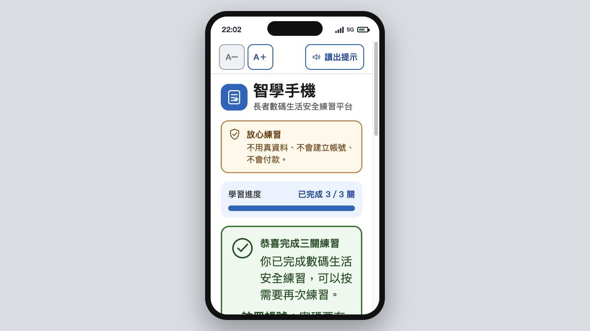

# 智學手機

**長者數碼生活安全練習平台**

「智學手機」是一個為香港長者而設的手機版互動教學網站。使用者可在不用真實資料、不會建立帳號及不會付款的環境中，放心嘗試、犯錯及重複練習。

## 學習設計

每個關卡均採用同一學習循環：

> 示範一次 → 跟着做 → 自己完成 → 溫和修正 → 成功回顧

現有三個順序解鎖關卡：

1. **註冊帳號**：姓名、電話、密碼、顯示密碼及逐項密碼規則。
2. **安全驗證**：本機自製圖像題及進階文字題，不使用第三方驗證服務或商標。
3. **外賣點餐**：選餐品、數量、購物車、修改及確認練習訂單，全程不付款。

## 長者友善及私隱設計

- 預設大字、高對比及最少56px主要觸控區。
- 支援 `A−／A＋` 三段字級及瀏覽器中文語音提示。
- 鍵盤焦點清楚；狀態以顏色、圖示及文字共同表示。
- 桌面瀏覽器顯示置中手機外框，真實手機使用滿版介面。
- 只在瀏覽器本機保存設定及完成進度。
- 不保存姓名、電話、密碼、餐品選擇或其他身份資料。
- 不設後端、真實帳號、付款、廣告或第三方追蹤。

## 離線後備截圖

`docs/screenshots/`已保存6張比賽展示後備圖片：

- 手機版三關完成首頁；
- 註冊帳號示範；
- 安全驗證圖片題；
- 外賣點餐餐牌；
- 導師匿名測試模式；
- 桌面版手機外框。



## 導師測試模式

在網址後加入 `?study=1`，例如：

```text
http://localhost:5173/?study=1
```

導師可使用匿名代碼 `P01` 至 `P05` 記錄：

- 第一次及第二次完成時間；
- 錯誤及求助次數；
- 練習前後1至5分信心評分；
- 未完成測試紀錄；
- UTF-8 BOM CSV匯出；
- 只根據同一參加者兩次已完成紀錄產生的成對摘要。

少於兩組有效配對時，介面只會顯示「數據不足」，不會填入示例或推算數字。正式比賽成果必須使用真實長者測試數據。

## 技術與本機運行

- React 18
- Vite 8
- TypeScript
- Vitest及React Testing Library
- 純前端、無後端

```bash
npm install
npm run dev
npm test
npm run build
npm run preview
```

## 本機儲存

網站使用以下版本化鍵值：

```text
smartphone-learning:v1:settings
smartphone-learning:v1:progress
smartphone-learning:v1:sessions
```

一般模式只保存設定及進度；`sessions`只會在導師測試模式寫入。損壞或無效資料會安全回復預設值。

## GitHub Pages部署

專案已包含自動部署流程。推送至`main`分支後，GitHub Actions會依序執行測試、正式建置及Pages部署。

首次建立Repository後，請在GitHub的 **Settings → Pages → Build and deployment** 選擇 **GitHub Actions**。Vite採用相對資源路徑，可部署至`https://<帳戶>.github.io/smartphone-senior-learning/`。

## 專案結構

```text
src/
  components/       共用介面、LessonEngine、首頁及導師工具
  data/             關卡定義
  domain/           驗證、點餐及研究摘要邏輯
  levels/           三個互動關卡
  services/         本機儲存及語音服務
  styles/           全域樣式及長者友善設計規範
  test/             測試環境設定
  types/            共用TypeScript型別
```

## 尚待實地完成

- 2名長者預試及5名長者各兩次正式測試；
- 使用真實成對數據整理比賽成果敘述；
- 不同實體手機及屏幕閱讀器的最終實機驗證；
- 30至60秒示範影片。

不得在未取得真實測試結果前填寫成效百分比或推算數據。
